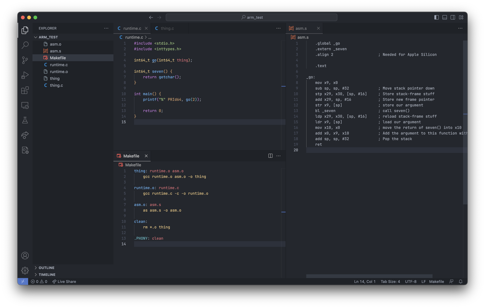

# CMSC430 Final Project Proposal
Ian Morrill

My main goal for my final project is to retarget Loot to compile programs to the arm64 architecture.

Based my conversation in the office hours and some initial reading about things, I have two ways that I may end up
implementing this project, either:

1. I retarget the a86 pretty printer to emit arm64 assembly instead of emitting x86. This would involve figuring out
crosswalks between arm64 and x86, which would vary in difficulty. For example, instructions like `add` and `sub` would
be trivial to translate because they are pretty much exactly the same, however things like `mov` would be significantly
more challenging because of the differences between x86 and arm64. This would be my preferred result though because it
would have the potential to remove the course's reliance on Apple's Rosetta system, which would be cool for me and
potentially helpful for the course staff.
2. Or, I focus on retargeting Loot only, essentially making a "a-arm64" and using that instead of a86. This would free
me of having to deal with unforseen difficulties in briding the gap between the inconsistencies of arm64 and x86.
However, it would be less cool. This is the option that I would likely switch to if option 1 proves too difficult.

Regardless of my choice of the above options, I would test my code by using the tests provided by the course staff for
Loot. If the tests pass all the same, then presumably I succeeded.

Of course, despite my excitement around this project now, there is a chance that neither option is feasible, in which
case I would naturally inform the course staff and use one of the suggested projects. Hopefully this will not be the
path I take though.

## Updates (after talking at the begining of class on 4/18)
To cover the issue of how I will link my project, I will be using the `gcc` alias provided by XCode's clang install. I
will also be using the `as` command provided by XCode to perform the assembly step.

I have attached a screenshot showing proof of being able to link an arm64 assembly file with a C file on macOS. Because
of how the formatting has decided to work, it will appear on the next page.

